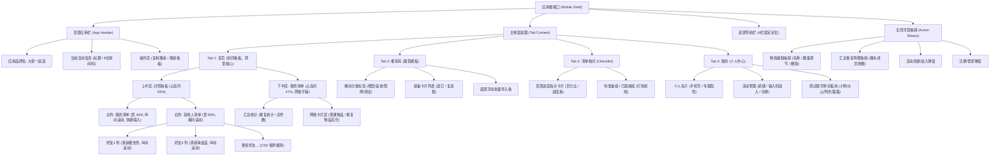

# 「大家一起选」页面结构与信息架构规范

本文档详尽定义「大家一起选」应用的页面骨架、层级关系、视口栅格以及不同手机长宽比下的自适应布局规则，供前端重构与后续多端适配参考。

---

## 1. 系统信息架构树 (IA Tree)



---

## 2. 页面视图层级与空间布局

### 2.1 整体视口结构
* **视口高度管理**：采用 `height: 100dvh`（Dynamic Viewport Height），在移动设备上动态跟随浏览器工具栏伸缩，杜绝传统 `100vh` 出现的底部遮挡问题。
* **安全区隔离**：
  * 顶部：`padding-top: calc(env(safe-area-inset-top) + 10px)`
  * 底部：`padding-bottom: env(safe-area-inset-bottom)`

```
+-----------------------------------------------------------+
| [大家一起选]               [邀请码：893215] [🔄] (Header) |
| 当前活动: 仙居山谷周末露营                   [复制邀请码] |
+-----------------------------+-----------------------------+
| 【我的清单】(薄荷绿)        | 【其他人清单】(向右滑 👉)   |
| --------------------------- | --------------------------- |
| [ 羊肉串        ×2 ]        | [大山: 4件]   [阿杰: 4件]   |
| [ 双人帐篷      ×1 ]        | [羊肉串 ×3]   [生菜   ×1]   |
| [ 卡式炉        ×1 ]        | [蛋卷桌 ×1]   [气罐   ×4]   |
|                             | [氛围灯 ×2]   [垃圾袋 ×1]   |
| [+ 添加物资...        (＋)] | (横向 scroll-snap 滑动)     |
+-----------------------------+-----------------------------+
| 【最终清单】 (全员物资汇总结算)      [⚠️ 1项重复] [共14项]  |
| +----------------+ +----------------+ +-----------------+ |
| | [重复] 羊肉串  | | 便携气罐(多瓶) | | 露营氛围灯      | |
| | 总数: ×5       | | 总数: ×4       | | 总数: ×2        | |
| | (小明, 大山)   | | (阿杰)         | | (大山)          | |
| +----------------+ +----------------+ +-----------------+ |
| (网格卡片平铺展示，上下滚动)                              |
+-----------------------------------------------------------+
| [📋 首页]    [💡 推荐库]    [✅ 清单核对]    [👤 我的]    |
+-----------------------------------------------------------+
```

---

## 3. 栅格划分与比例规格

### 3.1 首页上半区（双向对照栏）
* **宽度配比**：
  * 左侧「我的清单」：`width: 44%; flex-shrink: 0;`。
  * 右侧「其他人清单」：`width: 56%; flex: 1; overflow: hidden;`。
* **右侧横向滚动规范**：
  * 好友列卡片宽度：固定 `width: 135px`。
  * 滚动行为：`scroll-snap-type: x mandatory`，每列吸附位置为 `scroll-snap-align: start`。
  * 视觉线索：在常见手机屏幕（375px~430px）宽度下，56% 容器宽度约为 210px~240px，展示第一位好友（135px）的同时必然会露出第二位好友的一半（75px~105px），自然诱导用户的大拇指进行左右滑动手势。

### 3.2 首页下半区（最终清单网格）
* **布局容器**：CSS Grid。
* **列数自适应规则**：
  * 标准手机屏幕（屏宽 $\ge 360\text{px}$）：采用 3 列平铺 `grid-template-columns: repeat(3, 1fr)`。
  * 窄屏小手机（屏宽 $< 360\text{px}$，如旧款 iPhone SE）：降级为 2 列平铺 `grid-template-columns: repeat(2, 1fr)`，保证卡片字体不被挤压。
* **卡片最小高度**：`min-height: 58px`，大字号品名搭配底部数量与微缩头像点。

---

## 4. 手机端不同屏幕长宽比的适配策略

| 屏幕比例 / 典型机型 | 视口典型尺寸 | 适配表现策略 |
| :--- | :--- | :--- |
| **传统 16:9**<br>(iPhone 6/7/8/SE2/SE3) | `375 × 667 px` | 上下半区按 `flex: 1.1` 与 `flex: 1` 压缩，卡片间距自动减小至 5px，快捷输入栏高度保持紧凑。 |
| **标准 19.5:9 全面屏**<br>(iPhone 13/14/15/16) | `390 × 844 px` | 黄金阅读比例，上半区展示约 5~6 项我的物品，下半区展示两整屏网格（约 9~12 张卡片）。 |
| **超长大屏**<br>(iPhone Pro Max, 华为 Mate 等) | `430 × 932 px` | 上下半区垂直滚动高度充分延展，内容更舒展，单屏可展示更多好友横向列。 |
| **桌面 PC 浏览器打开** | 任意宽屏 | 自动启用 `.app-viewport-wrapper`，在屏幕中央渲染一台具备 440px 最大宽、圆角和外边框阴影的逼真手机外壳，还原 100% 真机视觉。 |

---

## 5. 组件与层级 (Z-Index) 规范

| 视图层级 | Z-Index | 说明 |
| :--- | :--- | :--- |
| **基础内容流** (Tab Views) | `0` ~ `10` | 普通列表、卡片、背景图层 |
| **顶部栏 Header** | `20` | 常驻顶端，确保列表滚动时不被遮盖 |
| **底部导航栏 Tabbar** | `30` | 常驻底端，支持 Safe-Area 沉浸式保护 |
| **全局浮层弹窗 / 抽屉** | `100` | 半透明毛玻璃背景 (`rgba(15,23,42,0.6)`) + Action Sheet |
| **Toast 轻提示** | `200` | 屏幕上方居中悬浮气泡，自动 2s 淡出 |
