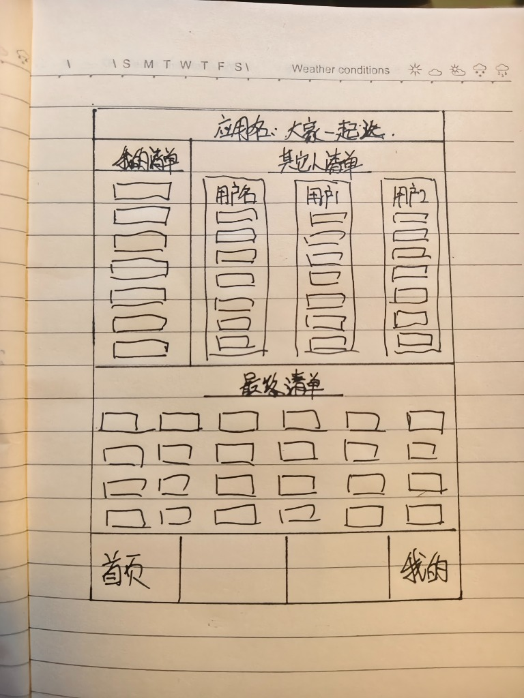
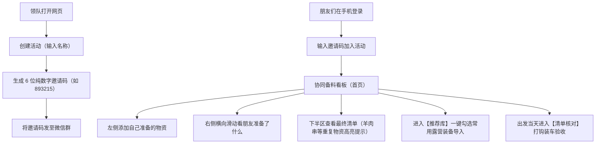

# 「大家一起选」产品需求文档 (PRD)

| 项目名称 | 大家一起选 (Camping Co-Select) |
| :--- | :--- |
| **文档版本** | V1.0.0 (Release) |
| **编写日期** | 2026-10-06 |
| **产品形态** | 移动端优先 Web 应用 (Mobile-First Web App) |
| **数据存储** | 本地 SQLite 关系型数据库 |
| **文档状态** | 已通过需求评审，进入基线维护阶段 |

---

## 1. 项目背景与问题陈述

### 1.1 现实痛点
在户外露营、轰趴聚会或自驾游等多场景下，参与成员通常需要分别采买或携带特定物资。传统的微信群沟通方式存在以下痛点：
1. **信息碎片化**：聊天记录容易被刷屏，难以统计当前总共准备了哪些物资。
2. **物资重复（撞车）**：多位成员不约而同准备了同类消耗品（例如：小明带了羊肉串，大山也带了羊肉串），导致食品变质或运力浪费。
3. **关键物资遗漏**：没有统一的清单核查机制，现场才发现谁都没带卡式炉气罐、防蚊液或垃圾袋。

### 1.2 解决方案
本产品依据手绘原型图的构思，设计一款基于手机浏览器直接打开的协同选品工具。通过**「上半区左右对照看板（自己 vs 别人）」**与**「下半区全局汇总全览（自动标注重复物资）」**，让整个团队在采购和装车过程中实现信息实时透明、杜绝撞车。



---

## 2. 产品定位与核心价值

* **极简免装**：基于手机端自适应网页开发，微信群内发个链接或 6 位房间码即可直接加入协作。
* **全局透明**：既能聚焦输入自己的清单，又能一指横滑查看所有好友清单。
* **智能查重**：在最终汇总清单中，多人准备的相同物品将自动打上醒目的**【重复】**标签与数量角标。
* **露营闭环**：不仅支持协同添加，还内置「露营推荐库（防止漏带）」与「现场打钩核对（防止落车）」。

---

## 3. 用户画像与典型业务流程

### 3.1 核心用户
* **发起人/领队**：组织露营聚会，负责建立活动并把 6 位房间码发给朋友。
* **参与成员**：通过手机加入活动，录入自己准备的物品，查看最终清单确认有无买重。

### 3.2 典型用户旅程


---

## 4. 功能需求规格说明

### 4.1 账号与权限系统
* **4.1.1 手机号注册/登录**：
  * 手机号规范：严格校验 11 位数字手机号格式。
  * 密码规范：6~8 位纯数字密码，便于手机端快速输入（软键盘调起纯数字模式 `inputmode="numeric"`）。
  * **用户昵称（必填，重点）**：注册时必须填写用户昵称（限制 1~12 字），该昵称将直接作为**用户名**在所有列表（包括我的清单、其他人清单横向列头、撞车物资贡献者明细、现场清单核对成员标签）中显示。
* **4.1.2 配色分配**：
  * 每位注册用户自动从专属马卡龙色库中轮换分配一个主题色，作为其在协同看板中的列背景色、卡片边框色及头像标牌。

### 4.2 协同工作台（首页核心看台）
严格对应手绘原型图的上下分割布局：

* **4.2.1 顶部栏（Header）**：
  * 居中展示应用名称：「大家一起选」。
  * 展示当前活动名称及 6 位纯数字随机邀请码，**页面无 emoji 图标，标准显示格式为：`邀请码：xxxxxx`**（如 `邀请码：893215`）。
  * 提供「复制邀请码」按钮，方便快速粘贴至聊天群。
* **4.2.2 上半区左侧：【我的清单】**：
  * 背景采用清新柔和的薄荷绿底色。
  * 支持内容随条目增加垂直平滑滚动（`-webkit-overflow-scrolling: touch`）。
  * 底部固定常驻快捷输入栏：输入名称回车或点击“＋”按钮即可秒级添加。
  * **个人清单严格禁止重名（重点原则）**：
    * 同一用户在同一活动内添加、推荐库导入或修改物资时，**个人清单内绝对不允许出现名称重复**。
    * 若尝试添加或重命名为已有物资，前端即时 Toast 提示拦截，后端严格校验并拦截（数据库通过 `UNIQUE INDEX (room_id, user_id, name)` 兜底保底）。
    * 如需增加携带份数，用户应点击已有卡片直接修改数量步进值（`×2`、`×3`），杜绝单人列表内出现多张同名卡片，同时保证最终清单数量统计真实准确。
  * 卡片交互：点击物资卡片，自屏幕底部滑出触控友好的 Action Sheet 抽屉，支持修改品名、数量步进调节（+/-）、删除物资（二次确认防误触）。
* **4.2.3 上半区右侧：【其他人清单】**：
  * 列表头部展示每位好友的昵称和拥有物资件数。
  * **横向平滑滚动**：CSS `scroll-snap-type: x mandatory`，每列固定宽度，右侧边缘微露，引导大拇指横滑操作。
  * **独立清新底色**：每位好友列使用各自专属的马卡龙色（大山：晨曦杏黄、阿杰：海盐冰蓝、露露：香芋淡紫等），一目了然。
  * 列内部支持独立上下纵向滚动查看该成员的所有物资。
* **4.2.4 下半区：【最终清单（汇总全览）】**：
  * 全宽网格平铺布局（自适应 3 列或 2 列）。
  * **自动聚合去重**：系统自动将所有用户提交的物品按名称聚合，汇总总数量。
  * **撞车特别标识（重复）**：
    * **判定规则**：当不同用户数 $\ge 2$ 时判定为重复。
    * **展示形态**：卡片边框高亮为暖珊瑚红，右上角挂鲜明的**【重复】**徽标，显示总份数（如 `×5`）。
    * **排版权重**：重复物资置顶优先排列在网格最前。
    * **明细穿透**：点击该卡片滑出半屏明细，清晰展示具体哪几位朋友各自带了几份（如：*小明 2把、大山 3把*），便于线下沟通分工。

### 4.3 底部四栏体系
* **第 1 栏【首页】**：即上述主协同看板。
* **第 2 栏【推荐库（露营模板）】**：
  * 内置露营场景常用装备库，包含 4 大类别：
    1. *栖居与装备*：帐篷、天幕、防潮垫、蛋卷桌、月亮椅等；
    2. *美食与炊具*：羊肉串、卡式炉、气罐、五花肉、饮用水等；
    3. *照明与动力*：营地灯、氛围串灯、户外电源等；
    4. *防护与清洁*：大号垃圾袋、驱蚊喷雾、便携急救包等。
  * 支持单件“+ 选它”即时添加到「我的清单」，已添加项显示“✓ 已添加”。
  * 顶部支持复选框多选，提供“批量加入我的清单”快捷操作。
* **第 3 栏【清单核对（现场打钩验收）】**：
  * 汇聚该活动下所有物资项，提供露营出发打包 Checklist。
  * **按用户分类展示（默认自己）**：在待准备物资下方提供横向**用户分类标签栏**（如：`小明 (我) (4/5)`、`大山 (3/4)`、`阿杰 (0/4)`、`全员总览`），**默认高亮选中当前登录用户自己**，优先展示自己负责的待准备物资，清晰不杂乱。
  * **准备进度比率标签**：每个成员标签后实时计算并显示 **`(已准备数 / 该用户负责总数)`**，例如 `(4/5)`，当某成员全部物资装车就绪时呈现全齐绿色高亮。
  * **权限控制（重点）**：**每位用户仅可勾选确认自己准备的物资**，无法代勾选或修改其他成员的物资状态。点击其他成员条目时界面提示归属人并锁定，后端严格进行 403 权限校验。
  * 顶部进度条与就绪率展示（如：`已准备 10 / 15 项 (67%)`）。
  * 点击圆圈复选框切换打钩，带有横线划除动画，区分“待准备”与“已装车”两个分组。
* **第 4 栏【我的（个人中心）】**：
  * 展示个人名片（手机号、专属颜色）。
  * 活动管理：新建活动、输入 6 位码加入活动、在参与过的多个活动间快速切换。
  * **🧪 快速切换测试账号**：内置小明、大山、阿杰、露露 4 个快速切换按钮，方便开发者及测试人员单机快速验证多人撞车场景。

### 4.4 实时数据协同与推送 (SSE 机制)
* **4.4.1 多端无感同步 (Zero-Refresh Realtime)**：
  * 好友在另一台手机上添加物资、批量导入、修改或打钩时，当前手机屏幕**无需任何手动下拉刷新**，数据通过标准 SSE (Server-Sent Events) 长连接通道实时推送到端。
  * 终端自动在后台静默重载看板数据，维持当前滚动位置与正在操作的模态窗口。
* **4.4.2 实时灵动浮层横幅 (Live Dynamic Notice)**：
  * 当远端好友完成物资添加、修改或装车核对时，屏幕顶部平滑滑出灵动深色胶囊横幅（如：`⚡ 大山 刚刚添加了【便携气罐 ×2】`），持续 3.2 秒后自动收起，支持触觉振动反馈。
* **4.4.3 列表条目“跳出更新”弹性动效**：
  * 远端新到达的条目在当前屏幕渲染时附带弹性缩放动效（`item-bounce-enter`），伴随高亮微发光，直观呈现“实时跳出”的协同质感。
* **4.4.4 顶部连接状态微徽章**：
  * 应用顶部常驻状态微胶囊：连通状态下显示绿色呼吸脉冲灯 `🟢 实时协同中`；网络波动时自动退避重连并提示 `🟡 重连中...`。

---

## 5. 数据库结构设计 (SQLite)

采用原生 SQLite (`DatabaseSync`)，无额外编译环境依赖。

```sql
-- 1. 用户表
CREATE TABLE users (
  id INTEGER PRIMARY KEY AUTOINCREMENT,
  phone TEXT UNIQUE NOT NULL,           -- 11位手机号
  nickname TEXT NOT NULL,               -- 昵称
  password TEXT NOT NULL,               -- 6~8位纯数字密码
  color_index INTEGER DEFAULT 0,        -- 马卡龙色盘索引
  created_at DATETIME DEFAULT CURRENT_TIMESTAMP
);

-- 2. 活动/房间表
CREATE TABLE rooms (
  id INTEGER PRIMARY KEY AUTOINCREMENT,
  code TEXT UNIQUE NOT NULL,            -- 6位纯数字邀请码 (100000~999999)
  title TEXT NOT NULL,                  -- 活动名称 (如: 仙居山谷周末露营)
  creator_id INTEGER NOT NULL,          -- 创建者ID
  created_at DATETIME DEFAULT CURRENT_TIMESTAMP,
  FOREIGN KEY(creator_id) REFERENCES users(id)
);

-- 3. 活动成员关联表
CREATE TABLE room_members (
  room_id INTEGER NOT NULL,
  user_id INTEGER NOT NULL,
  joined_at DATETIME DEFAULT CURRENT_TIMESTAMP,
  PRIMARY KEY (room_id, user_id),
  FOREIGN KEY(room_id) REFERENCES rooms(id) ON DELETE CASCADE,
  FOREIGN KEY(user_id) REFERENCES users(id) ON DELETE CASCADE
);

-- 4. 物资条目表
CREATE TABLE items (
  id INTEGER PRIMARY KEY AUTOINCREMENT,
  room_id INTEGER NOT NULL,             -- 关联活动
  user_id INTEGER NOT NULL,             -- 关联所属用户
  name TEXT NOT NULL,                   -- 物资名称 (如: 羊肉串)
  quantity INTEGER DEFAULT 1,           -- 数量
  is_checked INTEGER DEFAULT 0,         -- 是否装车清点 (0:未勾选, 1:已勾选)
  created_at DATETIME DEFAULT CURRENT_TIMESTAMP,
  updated_at DATETIME DEFAULT CURRENT_TIMESTAMP,
  FOREIGN KEY(room_id) REFERENCES rooms(id) ON DELETE CASCADE,
  FOREIGN KEY(user_id) REFERENCES users(id) ON DELETE CASCADE
);

-- 5. 露营推荐预设模板表
CREATE TABLE recommend_templates (
  id INTEGER PRIMARY KEY AUTOINCREMENT,
  category TEXT NOT NULL,               -- 分类 (栖居/美食/照明/清洁)
  name TEXT NOT NULL,                   -- 物资品名
  icon TEXT DEFAULT '⛺',               -- Emoji 图标
  unit TEXT DEFAULT '件'                -- 推荐单位
);
```

---

## 6. 非功能性需求与规范

1. **设备与长宽比适配**：
   * 采用 `100dvh` (Dynamic Viewport Height) 视口，防 Safari 地址栏抖动。
   * 兼容主流屏幕长宽比（从 iPhone SE 4.7 寸、iPhone 14/15/16 标准与 Pro Max 到主流 Android 机型）。
   * 严格适配 iOS `safe-area-inset-top` 与 `safe-area-inset-bottom`。
2. **触控与移动端交互体验**：
   * 按钮与点击热区最小高度 $\ge 40\text{px}$，避免误触。
   * 禁用全页非必要文字选中（`user-select: none`），保留输入框文字选择。
   * 按钮与卡片点击具备轻量弹性反馈（`active: scale(0.97)`）。
3. **网络与轻量化**：
   * 纯原生现代技术，静态资源整体体积 $< 60\text{KB}$，无大型重度前端框架，首屏渲染耗时 $< 100\text{ms}$。

---

## 7. 后续版本迭代路线图 (Roadmap)

* **V1.1 (实时性增强)**：引入 WebSocket / SSE，好友在另一台手机添加物资时，当前屏幕无需手动刷新即可实时跳出更新。
* **V1.2 (微信分享无感直连)**：支持通过微信 SDK 或短链接参数直接带入房间码，实现“点开链接直接进房”。
* **V2.0 (费用记账与 AA 结算)**：物资条目支持输入垫付金额，露营结束后系统自动生成 AA 平摊转账账单。
